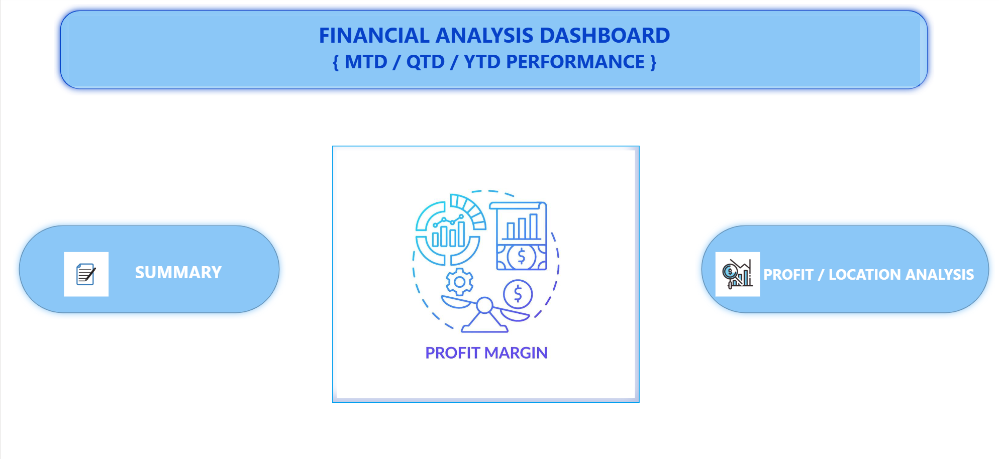
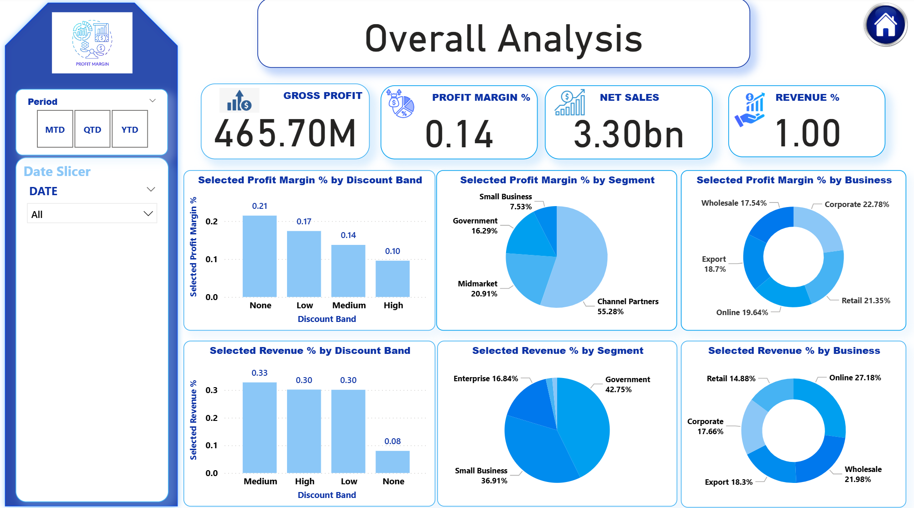
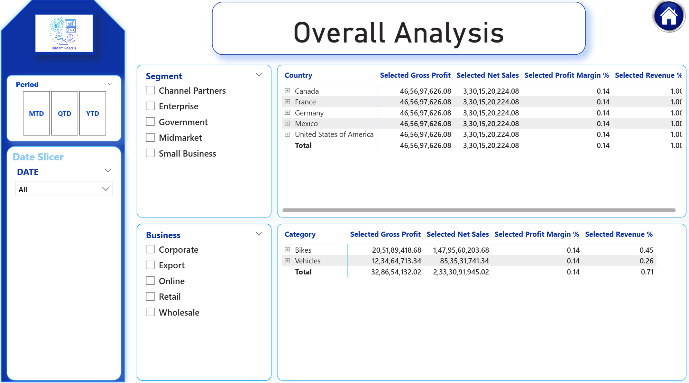

## 📊 Financial Analysis Dashboard
The dataset contains financial performance details including sales, profit, revenue %, discount bands, and business segments across different countries and categories. It is used to calculate key KPIs like Gross Profit, Net Sales, Profit Margin %, and Revenue % for MTD, QTD, and YTD analysis.

## 📌 Project Objective
This dashboard is designed to analyze Gross Profit, Profit Margin %, Net Sales, and Revenue % across different segments, businesses, discount bands, and locations.
It provides insights into MTD (Month-to-Date), QTD (Quarter-to-Date), and YTD (Year-to-Date) performance.

## 🔑 Key Features
 Summary Page: High-level KPIs including Gross Profit, Profit Margin %, Net Sales, and Revenue %.
 Profit Margin Analysis: Breakdown by
- Discount Band
- Segment (Government, Midmarket, Small Business, etc.)
- Business Type (Corporate, Retail, Wholesale, Online, Export).
- Revenue Analysis: Distribution by discount, segment, and business.
 Location & Category Analysis:
- Country-wise (USA, Canada, France, Germany, Mexico).
- Category-wise (Bikes, Vehicles).

## 📈 Key Insights
- Gross Profit: 465.7M
- Profit Margin %: 0.14
- Net Sales: 3.30B
- Highest revenue contribution comes from Government and Small Business segments.
- Channel Partners drive the largest share of Profit Margin %.

## Dataset Used

## 📂 Dashboard Pages

## ⚙️ DAX Measures Used
- Gross Profit
Gross Profit = SUM('Sales'[Gross Profit])

- Net Sales
Net Sales = SUM('Sales'[Net Sales])

- Profit Margin %
Profit Margin % = DIVIDE([Gross Profit], [Net Sales], 0)

- Revenue %
Revenue % = DIVIDE([Net Sales], CALCULATE(SUM('Sales'[Net Sales]), ALL('Sales')), 0)

## ⚠️ Challenges Faced
- Data Cleaning & Preparation
- Raw data contained duplicates, missing values, and inconsistent formats.
- Had to standardize categories (e.g., discount bands, business types) before analysis.
- Complex DAX Calculations
- Creating accurate measures like Profit Margin %, Revenue %, and time-based (MTD/QTD/YTD) calculations required careful DAX formula design.
- Ensuring no circular dependencies while combining multiple KPIs.
- Time Intelligence Implementation
- Handling MTD, QTD, and YTD performance using a proper Date table and relationships.
- Making slicers interact correctly across visuals.

 Visual Optimization:
- Selecting the right visuals (donut, bar, pie, KPIs) to ensure clarity without overcrowding.
- Balancing between detailed drilldowns and a clean, executive-friendly layout.
- Performance Issues
- Large dataset slowed down visuals initially.
- Optimized by creating calculated columns/measures instead of importing pre-calculated fields.

## 🚀 Future Enhancements
- Add trend analysis over time (YoY growth, rolling averages).
- Integrate forecasting models for sales and profit prediction.
- Enhance with drill-through reports for customer-level details.
- Mobile-optimized version for quick executive insights.
